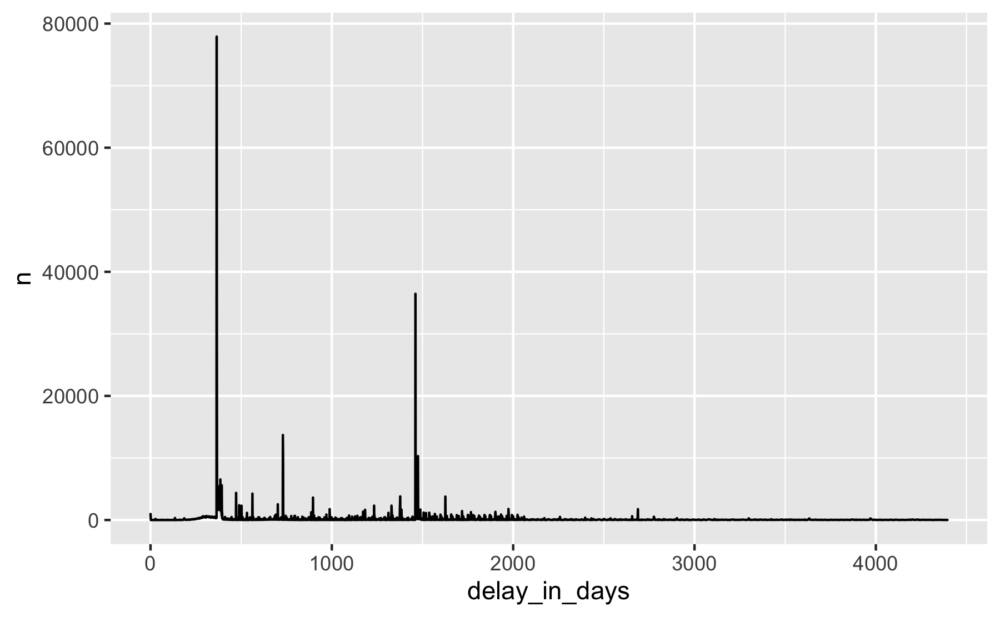

# Notes: Loading the Crossref dump into Google BigQuery with R

In April 2020, Crossref made a data file of its index freely available
via Academic Torrents

<https://doi.org/10.13003/83B2GP>

Here, I describe how I downloaded and parsed a subset from the dump,
comprising journal articles published since 2008, and loaded it into
Google BiqQuery for large-scale analysis.

## Aim

Make use of the Crossref dump for publisher and journal-specific
analysis focusing on

  - Publication volume
  - License information
  - Links to full texts for text mining

for journal articles published since 2008.

Complements the API route to access Crossref metadata.

## Methods

### Download Dump

Download from [Academic
Torrents](http://academictorrents.com/details/0c6c3fbfdc13f0169b561d29354ea8b188eb9d63)
via the command line:

``` shell
$ wget http://academictorrents.com/download/0c6c3fbfdc13f0169b561d29354ea8b188eb9d63.torrent
$ ctorrent 0c6c3fbfdc13f0169b561d29354ea8b188eb9d63.torrent
```

Duration: 45 minutes.

The dump itself consists of 37501 json-formatted files à 3.000 Crossref
records.

### Data transformation

Considerations:

  - With rcrossref, a well-tested and widely used parser for Crossref
    metadata already exists
  - Only a subset of metadata is needed for the analysis
  - Already Split files makes it possible to process dump files
    independently from each other

Pipeline:

  - [rcrossref\_parser.R](rcrossref_parser.R) copy of internal parser
    functions from rcrossref
  - [cr\_dump\_parser.R](cr_dump_parser.R) use of rcrossref parser in
    specific pipeline for processing the dump files
  - [read\_and\_write.R](https://github.com/njahn82/cr_dump/blob/master/read_and_write.R#L32)
    apply parser on each dump file in multiple sessions using future and
    future.apply package

Machine: [Amazon EC2
c5.4xlarge](https://aws.amazon.com/ec2/instance-types/c5/).

Lessons learned:

  - Checking for relevant files before applying the parser significantly
    speed-ups the process\!
  - Tracking the parsing process is critical (files parsed, and cpu
    usage). A great tool is [htop](https://hisham.hm/htop/).
  - Process should be stopped and re-started after some CPUs have
    finished their task

### Upload transformed data to Google BiqQuery

Pre-processing:

  - Google BQ does not allow `.` in field names. I had to changed it
    using the bash script [bash\_sed\_bq.sh](bash_sed_bq.sh) (Absolute
    file paths are not a good practise)

Upload to Google Cloud Storage in parallel:

``` shell
$ gsutil -m cp -r data_parsed gs://cr_dump
```

Load into BQ

``` shell
bq load --ignore_unknown_values 
        --source_format=NEWLINE_DELIMITED_JSON 
        api-project-764811344545:cr_dump_march_20.cr_08_20 
        gs://cr_dump/data_parsed/*.json schema_cr.json
```

Upload and loading was the quickest, around 15 minutes upload time, and
75s to populate the BQ table.

## Use cases

``` r
library(tidyverse)
# connect to google bq
library(DBI)
library(bigrquery)
con <- dbConnect(
  bigrquery::bigquery(),
  project = "api-project-764811344545",
  dataset = "cr_dump_march_20"
)
bq_auth()
```

### Journal article volume by publisher (Top 10)

``` sql
SELECT member, publisher, COUNT(DISTINCT(doi)) as n
FROM `api-project-764811344545.cr_dump_march_20.cr_08_20_expanded` 
GROUP BY member, publisher
ORDER BY n DESC
LIMIT 10
```

| member | publisher                                                |       n |
| :----- | :------------------------------------------------------- | ------: |
| 78     | Elsevier BV                                              | 7482517 |
| 297    | Springer Science and Business Media LLC                  | 3528690 |
| 311    | Wiley                                                    | 3216975 |
| 301    | Informa UK Limited                                       | 1674439 |
| 179    | SAGE Publications                                        |  813193 |
| 276    | Ovid Technologies (Wolters Kluwer Health)                |  799609 |
| 286    | Oxford University Press (OUP)                            |  793662 |
| 316    | American Chemical Society (ACS)                          |  574471 |
| 263    | Institute of Electrical and Electronics Engineers (IEEE) |  553623 |
| 266    | IOP Publishing                                           |  486628 |

Displaying records 1 - 10

### Licence penetration

#### Articles with license information

``` sql
SELECT COUNT(DISTINCT(DOI)) as n
FROM `api-project-764811344545.cr_dump_march_20.cr_08_20_expanded` 
WHERE ARRAY_LENGTH(license) > 0
```

28300442 articles published since 2008 have licence information.

#### Creative Commons license URLs by publisher (Top 10)

``` sql
SELECT publisher, COUNT(DISTINCT(DOI)) as n
FROM `api-project-764811344545.cr_dump_march_20.cr_08_20_expanded`, unnest(license) as license
WHERE REGEXP_CONTAINS(license.URL, 'creativecommons')
GROUP BY publisher
ORDER BY n DESC
LIMIT 10
```

| publisher                               |      n |
| :-------------------------------------- | -----: |
| Elsevier BV                             | 550737 |
| Springer Science and Business Media LLC | 496688 |
| MDPI AG                                 | 334704 |
| Public Library of Science (PLoS)        | 264634 |
| Hindawi Limited                         | 206434 |
| IOP Publishing                          | 189638 |
| Informa UK Limited                      | 104001 |
| Wiley                                   |  89063 |
| Walter de Gruyter GmbH                  |  77809 |
| Frontiers Media SA                      |  70649 |

Displaying records 1 - 10

#### Open Archive Elsevier

``` sql
SELECT license.delay_in_days, COUNT(DISTINCT(DOI)) as n
FROM `api-project-764811344545.cr_dump_march_20.cr_08_20_expanded`, unnest(license) as license
WHERE REGEXP_CONTAINS(license.URL, 'elsevier.com/open-access/userlicense/1.0/')
GROUP BY license.delay_in_days
ORDER BY delay_in_days
```

``` r
ggplot(els_delay, aes(delay_in_days, n)) +
  geom_density(stat = "identity") 
```



### Text mining

#### How many publisher provide full-text links intended for text mining?

``` sql
SELECT COUNT(DISTINCT(publisher)) as n
FROM `api-project-764811344545.cr_dump_march_20.cr_08_20_expanded`, unnest(link) as link
WHERE link.intended_application = 'text-mining' and link.content_version = 'vor'
```

| n    |
| :--- |
| 4304 |

1 records

#### What file fomats are supported?

``` sql
SELECT link.content_type, COUNT(DISTINCT(doi)) as n
FROM `api-project-764811344545.cr_dump_march_20.cr_08_20_expanded`, unnest(link) as link
WHERE link.intended_application = 'text-mining' and link.content_version = 'vor'
GROUP BY link.content_type
ORDER BY n DESC
LIMIT 10
```

| content\_type                                                           |       n |
| :---------------------------------------------------------------------- | ------: |
| application/pdf                                                         | 7904105 |
| text/xml                                                                | 7417175 |
| text/plain                                                              | 7413985 |
| text/html                                                               | 4239213 |
| unspecified                                                             | 2733169 |
| application/xml                                                         | 1378351 |
| application/epub+zip                                                    |   12779 |
| application/octet-stream                                                |    4968 |
| application/vnd.openxmlformats-officedocument.wordprocessingml.document |    3537 |
| application/msword                                                      |    2462 |

Displaying records 1 - 10

### Limits

  - It needs to be validated whether all records were correctly parsed.
    At least, there’s a slight difference between our Unpaywall dump and
    the imported Crossref dump.

<!-- end list -->

``` sql
SELECT COUNT(DISTINCT(upw.doi)) as no_overlap
FROM   `api-project-764811344545.oadoi_full.mongo_upwFeb20_13_20` as upw
WHERE genre = 'journal-article' AND NOT EXISTS (SELECT 1 
                   FROM `api-project-764811344545.cr_dump_march_20.cr_08_20_expanded` as cr
                   WHERE  LOWER(cr.doi) = upw.doi)
```

| no\_overlap |
| :---------- |
| 130715      |

1 records

  - Journal disambigation needed, maybe using `issn-l`
  - Generally, not all crossref metadata fiels were imported
